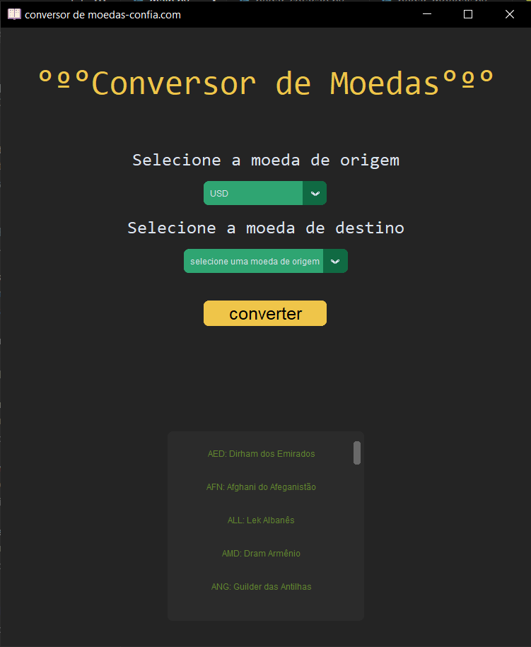

# Conversor de Moedas

## Conversor de moedas na linguagem de progamação Python

Bem-vindos ao reposotório "Conversor de Moedas".
Este reposotório foi criado para fins didáticos. É a conclusão de um projeto feito pelos alunos do SENAI-SP de Osvaldo Cruz.
O projeto consiste em um conversor de moedas que é capaz de converter todas as moedas do mundo para euro, real brasileiro, dólar americano e Biticoin. 

## Súmario

- Funcionalidades
- Instalação
- Pré-requisitos
- Screenshots
- Aprendizados
- Autores


## Funcionalidades

- Modo tela cheia
- Interface gráfica compreensível, logo, acessível para todos
- Lista de tradução de moedas (ex: BRL - Real Brasileiro)
- Converter Moedas, ou seja, converter uma o valor monetário de uma moeda para os disponíveis na biblioteca para a conversão no APP


## Instalação

### Pré - requisitos
Para a instalação e necessário ter certas extensões, e o App do Python na versão 3.12 (64 bit), segue as extensões necessárias no virtual studio code:
- Pylance
- Python
- Python Debugger
- XML Tools

Também para a instalação e necessário ter instalado as bibliotecas a seguir:

- customtkinter
- requests
- xmltodict

instalação do customtkinter:

```bash
pip customtkinter install
```
instalação do requests:

```bash
pip requests install

```
instalação do xml:
```bash
pip xmltodict install
```

E para clonar o repositório basta fazer isso:
```bash
 git clone https://github.com/Liv1aluk/Conversor-de-moedas.git
```
## Screenshots

!

## Aprendizados

Nesse projeto aprendemos mais sobre a linguagem Python, o funcionamento de uma biblioteca na projeto, e a progamação na prática do funcionamento de um APP e de como construir uma interface gráfica organizada e compreensível utilizando o Virtual Studio Code e o Github.


## Autores

Os autores deste projeto são:

- Lívia Luque Monarin - n° 9

- Maria Clara De Araujo Patta - n° 30

- Graziella Bortolotti - n° 6

- Vitória Dos Santos Fernandes - n° 17